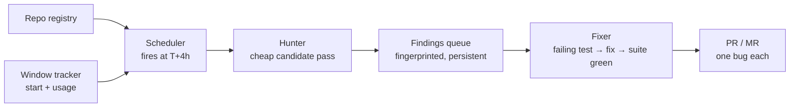

# Idle-Token Bug Hunter (working title)

A self-hosted detail.dev: register repos, and a server hunts bugs in them —
funded entirely by the *unused* capacity of a Claude subscription's 5h rolling
budget window.

## Why this can work

- Subscription budget is perishable: unused capacity at window close is worth $0.
- Marginal cost of scanning ≈ 0 when the human is idle (sleep, meetings, weekends).
- detail.dev proves the product shape works; the delta here is "runs on capacity
  I already pay for" instead of a second SaaS bill.

## What detail.dev actually does (reference model)

1. Clone repo into a sandbox, confirm it builds.
2. Exercise the code: thousands of checks/diagnostics, not just static reading.
3. Triage hard: surface only the top ~1% of findings.
4. Deliver writeups to Linear / Jira / GitHub Issues / email.

Their moat is step 3. Every testimonial praises signal-to-noise, not bug volume.
An unfiltered agent firehose is a spam generator, not a product.

## Core loop (sketch)



- **Window tracker** — knows when the current 5h window opened and how much has
  been consumed; computes "time until reset" and "capacity left in the tail."
- **Scheduler** — fires in the final hour of an active window. Picks work from
  the findings queue first (fix known bugs), then spends leftovers on hunting.
- **Hunter** — headless agent (`claude -p` / Agent SDK) running a bug-hunting
  playbook. Output is *candidates*, cheap and unpolished, into the queue.
- **Fixer** — takes one candidate and climbs the evidence ladder as high as the
  bug allows:
  1. *Failing test* committed alongside the fix — gold standard.
  2. *Reproduction that isn't a test* — script, curl sequence, REPL trace,
     recorded verbatim in the PR description.
  3. *Argued trace* — a written data-flow walkthrough proving the defect
     (races, config/env bugs, code with no test harness).
  Below rung 3 → not a PR, stays a queue note. Every PR states its rung.
  **No-harness policy (decided in exp1):** the fixer NEVER introduces a test
  framework as a bug-fix side effect. Bugs in un-harnessed layers ship at
  rung 3 and the gap goes on a per-repo infrastructure queue: (a) a unit
  harness PR when the buggy logic is extractable, (b) an *exercise harness*
  (mock external world + E2E driver) as first-class per-repo infra — it
  upgrades whole bug classes to rung 2 and doubles as the hunter's
  "exercise the code" tooling. Harness PRs are their own deliverable, stacked
  under the fix PRs they retrofit tests onto.
- **PR/MR** — one bug per PR: evidence + fix + writeup (what breaks, why, what
  the *intended* behavior is). Human review is the final signal-to-noise
  gate — and it's a gate you already know how to operate.
- **Findings queue** — persistent, fingerprinted (file + symbol + bug class);
  survives window resets, suppresses re-hunting spots with open PRs or
  rejected findings.

## Trigger: continuous window chaining

Open windows as fast as possible, back to back: the moment one resets, a cheap
message opens the next. Every 5h block of the week becomes harvestable.

- **The tracker becomes trivial.** If the chain opens (nearly) every window,
  window start is self-observed — reset time is known, not inferred. Log/
  rate-limit inference is only needed for cold start, crash recovery, and the
  case where the human's early prompt opened the window first.
- **Nice side-effect for the human:** the workday starts inside an
  already-ticking window — morning usage lands in a window that resets
  mid-morning, so heavy interactive use gets a fresh budget sooner.
- **Contention policy replaces trigger logic.** Windows are always open; the
  question is capacity allocation *within* each one:
  - Off-hours windows (nights, weekends): scavenger throttles up — heavy
    fix+test+PR work.
  - Work-hours windows: scavenger throttles down — small hard-capped hunt
    jobs only, generous headroom reserved for the human.
- **The 7-day cap is the real budget (window spike, 2026-07-23).** Anthropic
  enforces 5h AND 7-day limits (plus a per-model-class 7d limit). Chaining
  makes every 5h window available, but the WEEKLY allocation decides how much
  any window may burn: one heavy exp1 day moved `anthropic:7d` 0.29 → 0.42.
  Scheduler rule: budget per-window spend as
  `(7d remaining − interactive reserve) / windows-until-7d-reset`, re-read
  the actual fraction each window, throttle down as the weekly cap nears.
- **Window state is directly readable** from `~/.omp/agent/agent.db`
  (`usage_history`: `used_fraction`, `status`, `resets_at` per limit —
  `anthropic:5h`, `anthropic:7d`, `anthropic:7d:<model-class>`), refreshed via
  omp's own `/usage` probes. Cold start, recovery, and the ops strip all read
  the same table; the orchestrator can force a fresh probe with the OAuth
  token from `auth_credentials`.
- Queue decouples phases across windows: hunt in day windows, fix from the
  queue at night. Preemption at reset costs almost nothing.
- Throughput target: **one great PR per day**. Night windows do the heavy
  fix+PR work; day windows refill the hunt queue. Quality bar beats volume.

## Scan strategies (rotate, don't do all at once)

- Diff-focused: bugs in last N days of commits (highest hit rate, cheapest).
- Data-flow hunts: unchecked user input → sink; error paths that drop data.
- Concurrency: shared state, lock ordering, async races.
- Resource leaks / unbounded growth (detail.dev's "CPU consumed indefinitely" class).
- Contract drift: doc/comment says X, code does Y; API schema vs. handler.
- Actually *run* things: build, tests, fuzz a parser, hit an endpoint. Exercised
  code beats read code.

## Harness

Subscription auth is table stakes — Claude Code, OMP, opencode, pi, Orca all
run fine on the subscription. Nothing to reverse-engineer. Choose on
capabilities instead:

1. Headless & scriptable: prompt in → transcript + artifacts out, exit code.
2. Playbooks: per-repo skills/instructions the worker picks up automatically.
3. Usage/budget introspection the window tracker can read.
4. Fan-out: subagents let one night window run several hunt strategies in
   parallel instead of one long serial session.

**v1 decision: OMP as the worker.** Already in daily use here; skills map 1:1
to hunt playbooks; subagents give the hunter cheap fan-out; budget readout
feeds the window tracker directly. Orca on top when worktree/terminal
orchestration earns its keep (isolated checkouts per scan are a natural fit).
`claude -p` stays the zero-dependency fallback.

Keep the worker contract thin so this stays swappable:

```
run(checkout, playbook, budget) -> { transcript, findings.json | branch }
```

The orchestrator around it is dumb code — cron + queue + git + forge API —
consumes zero tokens, and doesn't care which agent runs inside.

## Findings UI

PRs deliver the *fixable* bugs, but the system produces more than PRs: hunt
candidates, rung-3 notes, rejected findings, window history. A small local
dashboard turns that from a folder of JSON into a product:

- **Inbox** — new findings ranked by severity × confidence; one-keystroke
  verdicts: promote→fix queue, reject (with reason), snooze, wontfix.
- **Finding page** — evidence rung, repro steps, trace, linked PR + its status.
- **Verdict memory is the point.** Every reject/wontfix lands in the
  suppression DB *and* in future hunt prompts ("known non-bugs in this area:
  …"). The UI is how the human teaches the hunter taste — each verdict makes
  next week's findings better.
- **Ops strip** — current window state, tonight's plan, tokens spent per PR.
- Stack: local web app, boring on purpose — SQLite + tiny server + one page.
  No auth, no cloud. SQLite doubles as the findings/suppression store the
  scheduler already needs.

## Hard problems (in honest order)

1. **Fix quality.** The failing test is a strong gate, but an agent can write a
   test that asserts its own misreading of intent — the fix "passes" while the
   behavior is wrong. Mitigation: one-bug PRs small enough to actually review,
   and the PR description must argue the *intended* behavior explicitly.
2. **Budget contention, two horizons.** Daytime: a greedy day-window job can
   throttle the human mid-afternoon (observed live: 5h window `exhausted`
   10:38→12:10 during exp1c; one worker died at that boundary, another
   absorbed it via retries). Weekly: unthrottled chaining eats the 7-day cap
   that interactive work also lives on. Guardrails: hard per-job caps,
   work-hours allocation (~1 fix cycle per day window), weekly allocation
   formula above, and an interactive reserve that scales down scavenging as
   `anthropic:7d` climbs. Tune from ops-strip data.
3. **Dedup — never surface the same bug twice.** Three layers: (a) exact
   fingerprint (repo + file + symbol + bug class) blocks re-queueing; (b)
   verdict memory — open PR, rejected, wontfix — suppresses re-hunting the
   spot; (c) semantic check: the hunter is shown prior findings for the files
   it scans and must argue novelty before filing. Refactors move code, so
   fingerprints alone won't hold.
4. **Terms-of-service exposure.** Continuous chaining is deliberate full
   utilization of a personal subscription via supported headless modes —
   defensible, but it *is* the maximalist posture. Accepted trade-off; stays
   single-user, single-account, and throttles politely. Revisit if Anthropic
   guidance changes.

## Open questions

- [x] Cold start / recovery (window spike): account window state lives in
      `agent.db:usage_history` (used_fraction/status/resets_at per 5h, 7d,
      7d-model limits). Steady-state reset time self-observed under chaining;
      recovery = read the table / force a usage probe.
- [x] Chain opener (exp2, measured): a dedicated opener is WASTE — minimal
      `omp -p` opener costs the full ~32k session floor. Pattern: **the first
      real job opens the window** (floor owed anyway); empty queue → direct
      API call (~10 tokens) via subscription OAuth, or keep the queue
      non-empty (hunts are infinite). Timing: 5h timer from open, verified
      against usage_history (staleness caveat: force probes for freshness).
- [x] Work-hours allocation (1b-informed): day-window jobs sized at 1 fix
      cycle max (~60–100k new tokens ≈ one worker session); tune from ops
      data. Session floor (~32k) argues for fewer, fuller sessions.
- [x] Token costs (exp1b, measured from session ledgers): fix+test+PR
      50–100k "new" tokens (median ~60k); diff hunt ~150k; harness/infra PRs
      90–400k; ~32k session floor (call-#1 cacheWrite). Headless `omp -p`
      matches subagent costs. Whole exp1 day (~1.05M new, 11 PRs) fit in one
      day's windows with zero throttling.
- [x] Worker capping (exp1b kill drill): enforce EXTERNALLY — watchdog tails
      the worker's session JSONL (written live, survives SIGTERM with zero
      corrupt lines) and kills at threshold; exit 143, workspace consistent
      at last completed step. Commit-per-step playbook ⇒ preemption ≈ free.
      Harness backstops: task.softRequestBudget (~3.5k new/call proxy),
      task.maxRuntimeMs.
- [x] Findings schema: v0 validated in exp1. v1 adds `verdict`+reason,
      `evidence_rung_achieved`, `pr_url`, `status`. `introduced_by` earned
      its place (all 5 findings traced to one feature commit).
- [x] PR mechanics (exp1): draft PRs; branch `fix/<slug>`; one bug per PR;
      PR body from uncommitted PR-DESCRIPTION.md, never committed; evidence
      comments cross-link harness PRs. Fork-and-PR for foreign repos still
      untested.
- [x] Suite-green requirement (exp1): affected toolchain fully (cargo test /
      svelte-check+lint ~1 min each even on a real repo); E2E per-spec on the
      fix branch. Full-suite cost never bit — revisit only if a big repo hurts.
- [x] Sandbox story (exp1): local git worktrees per fix, shared caches
      (node_modules copy, wasm artifacts) worked well; needs hygiene (target/
      + node_modules cleanup after ship). Containers deferred until foreign
      repos enter the registry.
- [x] Fixer test policy (exp1): test tier follows code shape — pure logic →
      extract+unit test; cross-boundary → test both sides; UI-glue → E2E at
      protocol level. Encode in fixer playbook.

## Non-goals (v1)

- Multi-user / SaaS anything.
- SOC 2, zero-data-retention theater — it's my machine, my repos.
- PR-time review (Bugbot territory, well served); this is *latent* bug hunting.
