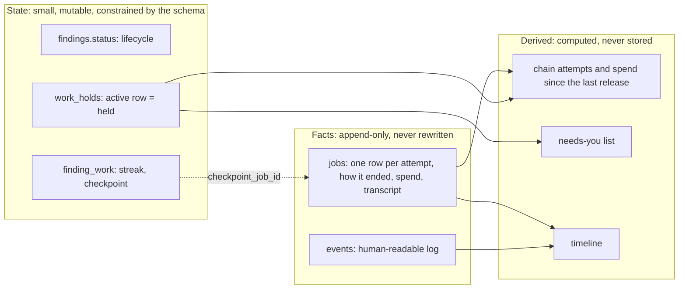
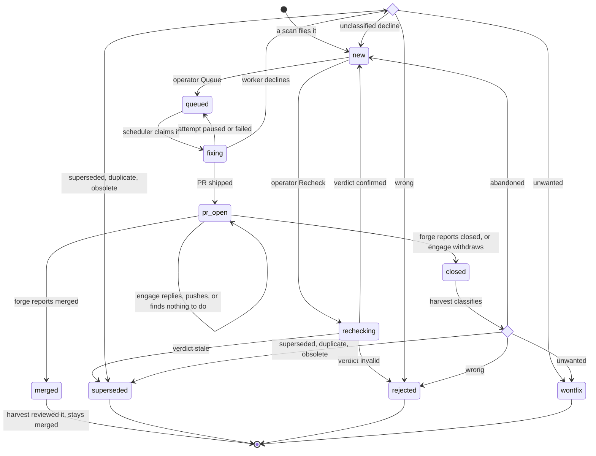
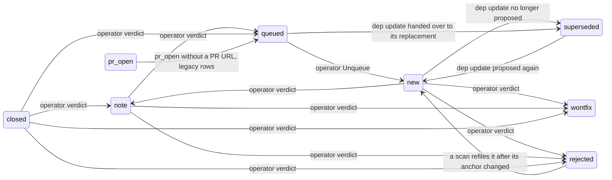
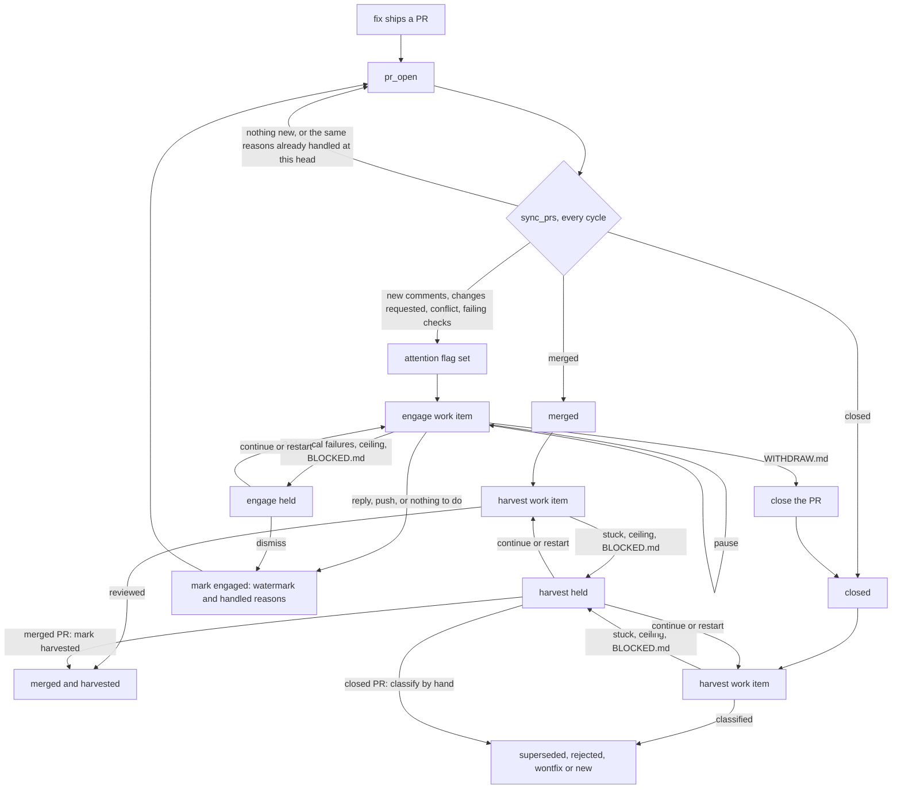
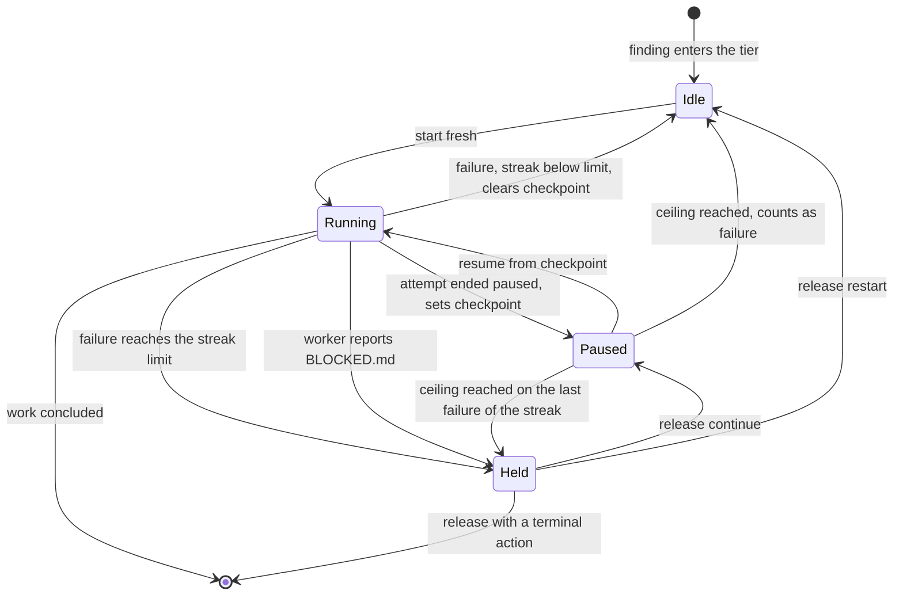
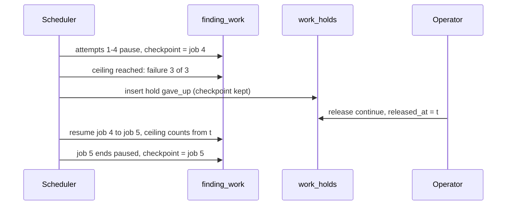
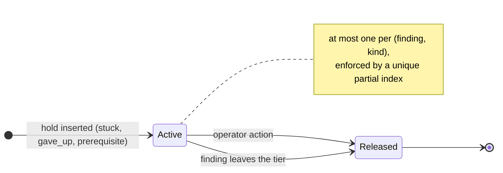

# WORK-MODEL.md: pausing, holding and giving up

**Status: proposal.** This describes the target model for how per-finding work gets paused, held for an operator, and given up. Nothing in it is implemented yet. Tracking issue: #88.

It came out of the review of #56. That PR fixed one runaway loop, but it showed that "blocked", "suspended" and "stuck" are each represented differently for every kind of work, in places that don't agree.

---

## 1. The problem today

| Symptom | Where |
|---|---|
| "Held" only exists for fix. It is three separate facts: `findings.status = blocked`, `jobs.state = suspended` and `jobs.blocker IS NOT NULL`. Each place that needs to know evaluates its own combination of them. | `block_fix_job`, `held_fix_blockers`, `list_resumable_jobs`, `retire_stranded_suspensions`, `resume_plan`, `prepare_blocked_resume` |
| `jobs.blocker` is copied into every resumed attempt and never cleared. Once a chain has been held, every later attempt carries the text. | `create_job` |
| "An operator requeued this" is inferred from `blocker` being set. A daemon restart in the middle of a resume, or a `release_claim` before the worker runs, makes the same inference true without any operator, and the chain resumes past the give-up ceiling. | `resume_plan` (`operator_requeued`), `reconcile_orphaned_jobs`, `release_claim` |
| What a hold is about (a missing prerequisite vs. a failure streak) is told apart by the `stuck: ` prefix of free text. | `streak_hold_report`, `is_streak_hold` |
| Job rows are records of attempts, yet they are rewritten after the fact: give-up flips `suspended` → `failed`, a hold flips a `failed`/`give-up` row back to `suspended`, the sweep marks rows `finding-moved`. | `retire_suspended_job`, `block_fix_job`, `retire_stranded_suspensions` |
| A recheck that keeps failing goes back to `new` with no reason, and looks exactly like a fresh finding. | `handle_recheck_failure` |
| A harvest given up on a **merged** PR has no way back: `merged` doesn't accept a verdict, no harvest endpoint exists, and the UI shows nothing. | `record_harvest_failure`, `FindingStatus::awaits_verdict` |
| An engage that fails without suspending (the worker doesn't reach `Done`, the push or the reply fails) leaves the attention flag set. Engage is the highest finding tier, so the PR is picked again every cycle, with no counter. | `record_engage` (Err arm), see the comment in `withdraw_pr` |
| A given-up engage chain only sets the PR's attention aside. That is visible as an `error` event, not as a state. | `count_given_up_chain`, `Store::set_attention_aside` |
| A `backend.run` error isn't counted for any kind. The cycle fails, and the same work is picked again 5 minutes later. | `run_*`, `daemon::compute_sleep_s` |
| A tree that can't be made (`open_workspace` fails) isn't counted for any kind. The work stays in its tier and is picked again every cycle. #5 fixes this for fix (and is asked to cover recheck and harvest). | `start_fix`, `run_recheck`, `run_harvest`, `start_engage` |

---

## 2. Terms

| Term | Meaning |
|---|---|
| **Finding** | A reported defect or improvement, with a lifecycle status (`new`, `queued`, `pr_open`, `merged`, …). |
| **Kind** | One kind of per-finding work: `recheck`, `fix`, `engage`, `harvest`. |
| **Work item** | One piece of work: a finding × a kind. It is **active** while the finding is in that kind's tier (§6.1). |
| **Attempt** | One worker run, i.e. one `jobs` row. |
| **Chain** | Attempts linked by `jobs.resumed_from`, continuing the same transcript and tree. |
| **Paused** | A work item with a checkpoint and no hold. The scheduler continues it on its own. |
| **Checkpoint** | The attempt whose transcript and tree the next attempt continues from. |
| **Failure** | An attempt, or a step before one, that ended without the work's outcome and without a pause (§7). |
| **Streak** | The number of consecutive identical failures of a work item. |
| **Ceiling** | The bound on how far the scheduler continues a chain on its own (`MAX_RESUME_ATTEMPTS`, `GIVE_UP_MULTIPLE`). |
| **Hold** | A work item stopped for an operator. It has a typed reason and a release. |
| **Release** | An operator's decision that ends a hold, recorded with who, when and which action. |

---

## 3. Principles

1. **Control flow reads state, never history.** Explicit state fields are what decisions use. History records what happened: it is never rewritten, and nothing decides from it. Every state change appends its history entry in the same transaction.
2. **Every kind is treated the same.** Each kind can pause, fail, get stuck and be held, through one shared mechanism. Kinds differ only in what counts as their outcome, what counts as a failure, and which release actions make sense.
3. **Every automatic retry is bounded.** By the streak, by the ceiling, or both. Nothing is retried every cycle without bound.
4. **Every give-up is visible and recoverable.** It ends in a hold with a typed reason and an explicit way out. It never ends in a silent status change or a flag.
5. **Operator decisions are data.** A release is a row, not something inferred from a leftover column.
6. **Each question has one answer in one place.** "Is this work item held?" and "what does it continue from?" are each one query, used by every tier, the preview, the sweep and the API.

---

## 4. Facts, state and derived values



- **Facts.** A `jobs` row is written when the attempt starts and completed once, when it ends. After that, nothing changes it: not a give-up, a hold, or a sweep. `jobs.state = suspended` means only "this attempt ended paused". It no longer means "this is resumable".
- **State.** It is small enough that the schema can enforce its invariants (a unique index for "at most one active hold").
- **Derived values** are fine as long as they aggregate immutable facts plus state. The problems in §1 come from deriving decisions from copied or rewritten data.

A `work_holds` row is both state and history. The active row (`released_at IS NULL`) is the current hold. Released rows are the record of past holds and their releases. Rows are only ever appended, and releasing one only fills in its `released_*` columns.

## 5. The finding lifecycle

This section walks a finding from the moment a scan files it to every terminal state, in the target model. It shows where each kind of work happens, where holds can occur, and who causes each transition. Where today's code differs, the difference is called out.

### 5.1 Status groups

| Group | Statuses | Owned by | Work item active |
|---|---|---|---|
| Inbox | `new`, `note` | the operator | none |
| Before a PR | `rechecking`, `queued`, `fixing` | the scheduler | recheck, fix |
| PR | `pr_open` | the forge and engage | engage |
| After the PR | `merged`, `closed`, until harvested | harvest | harvest |
| Terminal | `merged` once harvested, `superseded`, `rejected`, `wontfix` | nobody, except the reopen paths in §5.3 | none |

`blocked` no longer exists: a held fix stays `queued`.

### 5.2 Main path



While a finding sits in `rechecking`, `queued`/`fixing`, `pr_open`, or `merged`/`closed` before harvest, the matching work item runs through the shared machine in §6.2: it can be idle, running, paused or held. None of that changes the finding's status. The only status moves the scheduler makes on its own are the ones drawn above, plus `fixing` ↔ `queued` around each fix attempt.

Two edges need a word:
- **Engage** changes the status only when it withdraws (`WITHDRAW.md` → `closed`). Everything else it does (replying, pushing review fixes, deciding there is nothing to do) leaves the finding `pr_open`; that's the self-loop. §5.4 draws engage in full: what raises the attention flag, each outcome, and its hold.
- **Back to `new`:**
  - A **declined fix** goes back to `new` when its decline file has no valid classification (`parse_decline`). The fix playbook's list doesn't offer `abandoned`, but the parser accepts it, so a fix worker writing it would land the finding in `new` too.
  - A **closed PR** goes back to `new` when the harvest classifies its closure as `abandoned`, which `harvest-closed.md` does offer.
  - In both cases the outcome says nothing about the finding, so it goes back to triage (`ClosureClass::status`).

### 5.3 Side transitions

These come from the operator, from later scans, and from the dep-update machinery:



- **Reopening:** `rejected → new` is `Store::reopen_suppressed`, used when a worker-anchored rejection's files changed and a scan files the finding again (`verdict_anchors`). `wontfix` has no anchor and is never reopened.
- **Daemon restart:** `fixing → queued` (`reconcile_orphaned_jobs`) is the same move as `release_claim`. It isn't a separate status path.

### 5.4 The PR phase



- **Engage withdraws:** the PR is closed, and the harvest that follows continues the engage worker's transcript (`plan.handoff`), so it doesn't start cold.
- **The PR is merged or closed on the forge while engage is held or paused:** the finding leaves `pr_open`. The engage hold is released as `finding-left-tier`, and harvest takes over.

### 5.5 Statuses and work items together

Pausing, getting stuck and being held never change a finding's status (§9.5, invariant 4). They happen inside the status, in the work item for that status's kind. Two diagrams together describe this: §5.2 draws how the **statuses** move, and §6.2 draws the **work-item machine** (idle, running, paused, held) that runs inside every status hosting work. It is the same machine for every kind.

| Kind | Host status | Outcomes (they leave from **running**) | Terminal releases (they leave from **held**) |
|---|---|---|---|
| recheck | `rechecking` | confirmed → `new`; stale → `superseded`; invalid → `rejected` | `reject` → `rejected`; `wontfix` → `wontfix` |
| fix | `queued`, `fixing` while running | PR shipped → `pr_open`; declined → its classification (§5.2) | `reject` → `rejected`; `wontfix` → `wontfix` |
| engage | `pr_open` | withdrawn → `closed`; replied, pushed or nothing to do → stays `pr_open` | `dismiss` → stays `pr_open`, attention handled |
| harvest | `merged` until harvested | reviewed → `merged`, harvested | `mark_harvested` → `merged`, harvested |
| harvest | `closed` until harvested | classified → `superseded`, `rejected`, `wontfix` or `new` | `classify` → the same edges as the worker's classification |

How the two levels connect:
- **Outcomes leave from running.** An outcome is how an attempt ends; the attempt is what decides the next status.
- **Terminal releases leave from held.** The operator decides instead of a worker. `continue` and `restart` stay inside the work item (§6.2).
- **Outside events can leave from any state.** These are the operator unqueueing a fix, and the forge reporting the PR merged or closed. The finding leaves the tier, which releases an active hold as `finding-left-tier` and clears the checkpoint (§6.3).
- **In fix, `running` is the `fixing` status** and every other state is `queued`. Starting an attempt claims the finding, and the attempt ending releases the claim.
- **In engage, `idle` covers both "no attention flag" and "flagged, not yet started".** A fresh start needs the flag (§6.1).

### 5.6 Gaps the walk exposes

Walking every path turned up these. Each needs a decision before or during implementation.

| # | Gap | Today | Proposed |
|---|---|---|---|
| G1 | The engage tier is keyed on a flag that `sync_prs` recomputes every cycle | A paused engage is resumable while the finding is `pr_open`, whatever the flag (`list_resumable_jobs`), so today's resume gate already ignores the flag | Engage is active while `pr_open`; the flag only decides whether to start fresh (§6.1). |
| G2 | Dep-update handover and refresh vs. a fix that has a checkpoint or a hold | `hand_over_queued_dep_updates` supersedes `queued` sources and `refresh_dep_update` rewrites `new`/`queued` ones. Held fixes are safe only because they are `blocked`. A **paused** fix is `queued`, so its finding can be superseded, or its target rewritten under the checkpoint. **Not verified by a test yet.** | Both skip a finding whose fix work item has a checkpoint or an active hold. Add a test for today's paused case first. |
| G3 | The engage → harvest handoff crosses kinds | The first harvest job is created with `resumed_from` = the engage job | A work item's checkpoint may point to another kind's job for the first attempt only. The handoff stays a special case in the plan, not a general cross-kind chain. |
| G4 | Operator actions on held work aren't verdicts on inbox statuses | `/api/verdict` only accepts `new`, `blocked`, `note`, `closed` | Release actions go through `POST /api/hold/release` (§12). `/api/verdict` keeps the inbox statuses and `closed`, and no longer accepts `blocked`. |
| G5 | The forge merges or closes the PR while an engage attempt is **running** | No state race: `run_cycle_inner` runs `sync_prs` before selection, and a cycle runs one candidate, so hunter only sees the merge on the next cycle. The running engage still pushes or replies (`push_and_reply`), and `mark_pr_engaged` doesn't check the status. The effects are on the forge side only: a push to a merged branch, or a reply on a closed PR. | Accept. The next sync moves the finding out of `pr_open`, which releases any engage hold and clears the checkpoint. |
| G6 | A PR closed on the forge and then reopened | `sync_prs` only revisits `pr_open` findings, so a reopened PR stays `closed` in hunter. [INFERENCE] | Out of scope; listed so it isn't forgotten. |
| G7 | What a by-hand harvest of a merged PR means | Nothing can retry or skip a given-up merged harvest | For `merged`, the action is "mark harvested", not "classify". It records that the PR was never reviewed. |
| G8 | Re-entering a tier | A finding that returns to `new` (abandoned, confirmed) and is queued again opens a new PR. `pr_state` streaks reset only when `pr_number` changes. | Leaving a tier resets the work item's streak and checkpoint (§6.3), so a second PR starts clean whatever its number. |
| G9 | A tree that can't be made, before any worker runs | `open_workspace` fails the job and the runner returns without counting. Recheck, harvest and engage outrank fix, so any of them starves everything below. #5 counts it for fix under the fixed key `workspace not created`, and is asked to do the same for recheck and harvest. | A failure for every kind (§7), with the fixed key and git's reason as detail. The hold that follows has no checkpoint: no worker ran. |

---

## 6. The work item

### 6.1 Tiers

A work item is **active** while its finding's status belongs to the kind. Within that, the work item is **eligible to start fresh** only under the kind's start condition. Resuming a checkpoint needs only the work item to be active; this matches the gate `list_resumable_jobs` uses today.

| Kind | Active while | Starts fresh when |
|---|---|---|
| recheck | `findings.status = rechecking` | always |
| fix | `findings.status IN (queued, fixing)` | `queued` |
| engage | `findings.status = pr_open` | `pr_state.needs_attention IS NOT NULL` |
| harvest | `findings.status IN (merged, closed)` and `pr_state.harvested_at IS NULL` | always |

The attention flag is deliberately **not** part of engage's active condition. `sync_prs` recomputes it every cycle, and it can flap (a flaky check going red and green). If the flag decided whether engage was active, the PR losing its flag for a cycle would count as the finding leaving the tier: it would release an engage hold and drop a paused engage's checkpoint (§5.6, gap G1).

The tier order is unchanged: budget override, then engage, harvest, recheck, fix, then repo-level resumes and rotation. A **held work item is skipped by its tier**, using one shared query.

### 6.2 State machine

Every kind follows the same machine:



Not drawn: a work item in any state ends when the finding leaves the tier (a verdict, a merge, …). An active hold is then released as `finding-left-tier`, and the checkpoint is cleared.

The states aren't stored as an enum. They are derived from the work item's fields:

| State | Derived as |
|---|---|
| Running | a `running` job exists for the (finding, kind) |
| Held | an active `work_holds` row exists |
| Paused | not held, `checkpoint_job_id IS NOT NULL` |
| Idle | none of the above, finding in the tier |

### 6.3 Transitions

| Trigger | Streak | Checkpoint | Hold | Event |
|---|---|---|---|---|
| Attempt ends with the work's outcome (§7) | reset | cleared | – | kind's own |
| Attempt ends paused (`job_state` = `suspended`) | unchanged | set to this job | – | `resume` |
| Failure, streak below `MAX_CONSECUTIVE_SAME_FAILURE` | +1, or 1 if the failure differs | cleared | – | kind's own |
| Failure reaching the limit | reset | kept if the failing attempt has a transcript, else cleared | `stuck` | `hold` |
| Ceiling reached | counts as the failure `resume chain gave up` | cleared, unless this creates a hold | `gave_up` if the limit is reached | `hold` or kind's own |
| Worker wrote `BLOCKED.md` | reset | set to this job | `prerequisite`, with the report as detail | `hold` |
| Release `continue` | – | kept | released | `release` |
| Release `restart` | – | cleared | released | `release` |
| Release with a terminal action (§9.3) | – | cleared | released | `release`, `verdict` |
| Finding leaves the tier | reset | cleared | released by `finding-left-tier` | `release` |
| Daemon restart: an orphaned `running` attempt that did work | unchanged | set to that job | unchanged | `resume` |

---

## 7. Failures and streaks

What counts as the outcome and as a failure, per kind. Pauses never count as failures.

| Kind | Outcome (work concluded) | Failure |
|---|---|---|
| recheck | a verdict: confirmed, stale or invalid | tree not made, no or invalid verdict file, worker not `Done` without a pause, runner error |
| fix | a PR shipped, or a decline (`NOT-A-BUG.md`/`DECLINED.md`) | tree not made, nothing to ship, push or PR failure, worker not `Done` without a pause, runner error |
| engage | the reply posted and/or the push done, or a no-op engage, or `WITHDRAW.md` carried out | tree not made, worker not `Done` without a pause, push failure, reply failure, PR close failure on withdraw, any pre-worker error (`engage_target`, PR view), runner error |
| harvest | a classification recorded, or the merged PR reviewed | tree not made, PR view or diff failure (before a job exists), unusable `CLOSE-REASON.json` or verdict, worker not `Done` without a pause, runner error |

"Tree not made" means `open_workspace` failed. It is counted under the fixed key `workspace not created`, with git's reason as the detail. The reason can't be the key, because it quotes the job's own tree path, which differs on every attempt and would reset the streak each time (G9).

Rules:
- **Identical failures count.** As today, the failure key decides "identical". A different key resets the streak to 1.
- **One limit for every kind:** `MAX_CONSECUTIVE_SAME_FAILURE = 3`.
- **A failure that can't be written ends nothing.** It is logged, and the work item stays as it was, as `record_*_failure` already does since #56.
- **A ceiling give-up is a failure** with the key `resume chain gave up` and the reason as detail, as #56 introduced.
- **The streak lives on the work item.** It replaces `findings.fix_attempts`, `findings.recheck_attempts`, `pr_state.harvest_attempts` and their `last_*_failure` columns, and engage gets one.

What is **not** a failure: a budget or disk-gate denial, operator pause, or a pause by the worker. These are scheduler-level waits; they don't belong to one work item.

---

## 8. Checkpoints and the ceiling

- **The checkpoint is a pointer** (`finding_work.checkpoint_job_id`), not a property of job rows. Giving up, holding, or the finding leaving its tier clears or keeps the pointer; job rows don't change.
- **Every kind can resume from a checkpoint.** This includes recheck, engage and harvest, for both automatic pauses and holds.
- **The ceiling counts what the scheduler did on its own.** It counts attempts and spend in the chain **started after the work item's last release**. Before any release, that is the whole chain.
  - An operator's `continue` therefore gives a fresh budget.
  - A daemon restart, a failed write or a `release_claim` never does.
  - This replaces `operator_requeued`.
  - It also removes the rule that a resumed held fix is held again as soon as it doesn't finish (`conclude_fix` with `previous_blocker`). After a `continue` the chain is ordinary again, bounded by the ceiling and the streak. If the prerequisite is still missing, the worker writes `BLOCKED.md` again.
- **The workspace sweep keeps what a checkpoint references.** Today it keeps the tree of every chain with a running or suspended attempt (`chain_status`). In the new model it keeps the trees of chains with a running attempt or referenced by a `checkpoint_job_id`.



---

## 9. Holds

### 9.1 Reasons

| Reason | Set when | Detail | Resume prompt |
|---|---|---|---|
| `prerequisite` | the worker wrote `BLOCKED.md` (any kind) | the report | "Re-evaluate the prerequisite …" (today's held-fix prompt, generalised per kind) |
| `stuck` | the third identical failure | failure key + output tail | "Earlier attempts kept failing with: … Continue and finish." |
| `gave_up` | the ceiling was reached and that failure completed the streak | the ceiling's reason (`4 attempts, the limit`, …) | as `stuck` |

The reason is an enum column. The prompt is chosen from it, not from the text.

`BLOCKED.md` becomes a generic worker report. The playbooks for recheck, engage, harvest and harvest-closed get a section on when to write it: for recheck, verifying needs something unavailable; for engage, a reviewer asks for a maintainer decision; for harvest, the PR can't be classified without a human.

### 9.2 Lifecycle



### 9.3 Release actions

| Action | recheck | fix | engage | harvest | Effect |
|---|---|---|---|---|---|
| `continue` | yes | yes | yes | yes | resume from the checkpoint; ceiling counts from now. Only offered when a checkpoint exists. |
| `restart` | yes | yes | yes | yes | drop the checkpoint, start fresh |
| `reject` / `wontfix` | yes | yes | – | – | the verdict, as today; the finding leaves the tier |
| `classify` | – | – | – | closed PR | the operator classifies the closed PR by hand; the work item concludes |
| `mark_harvested` | – | – | – | merged PR | the PR is marked harvested without a review (§5.6, G7); the work item concludes |
| `dismiss` | – | – | yes | – | mark the current attention handled, as a no-op engage would (`mark_pr_engaged`) |

Every release appends a `release` event with the actor and action, and fills in `released_at`, `released_by` and `release_action` on the hold row.

### 9.4 Engage specifics

- **A held engage stays held when the PR gets new activity.** Only an operator releases it. The card shows "new activity since hold". The new activity may well be what the hold is waiting for, but whether it resolves the hold is the operator's call.
- **The attention flag isn't touched by holding.** The engage tier skips the work item while it is held. `Store::set_attention_aside` goes away.
- **A failed withdrawal counts as a failure.** Today it is marked engaged to stop the loop. With a streak it no longer needs that.

### 9.5 Invariants

1. At most one active hold per (finding, kind): a unique partial index.
2. A hold exists only for an active work item. When the finding leaves the tier, the same transaction releases the hold.
3. Every tier, `preview_next`, the sweep and the API use the same query to decide "held".
4. A hold never changes `findings.status`. In particular, `FindingStatus::Blocked` no longer exists: a held fix stays `queued`.

---

## 10. Storage

```sql
-- One row per (finding, kind) that has ever had state worth keeping.
CREATE TABLE finding_work (
  finding_id        INTEGER NOT NULL REFERENCES findings(id) ON DELETE CASCADE,
  kind              TEXT    NOT NULL,          -- recheck|fix|engage|harvest
  streak            INTEGER NOT NULL DEFAULT 0,
  last_failure      TEXT,                      -- the streak's key
  checkpoint_job_id INTEGER REFERENCES jobs(id),
  PRIMARY KEY (finding_id, kind)
);

CREATE TABLE work_holds (
  id             INTEGER PRIMARY KEY,
  finding_id     INTEGER NOT NULL REFERENCES findings(id) ON DELETE CASCADE,
  kind           TEXT    NOT NULL,             -- recheck|fix|engage|harvest
  reason         TEXT    NOT NULL,             -- prerequisite|stuck|gave_up
  detail         TEXT    NOT NULL,
  held_at        INTEGER NOT NULL,             -- epoch ms
  released_at    INTEGER,                      -- NULL = active
  released_by    TEXT,                         -- operator name | finding-left-tier
  release_action TEXT                          -- continue|restart|reject|wontfix|classify|mark_harvested|dismiss
);
CREATE UNIQUE INDEX work_holds_one_active
  ON work_holds(finding_id, kind) WHERE released_at IS NULL;
```

- `kind`, `reason` and `release_action` are Rust enums mapped via `sqlx::Type`, as `CODING_STANDARDS.md` requires.
- The table is named `work_holds` rather than `holds`, so it doesn't read as related to `verdict_anchors.holds_while`.
- The checkpoint lives only on `finding_work`. A hold doesn't need its own copy.
- `events` stays the human-readable log, with two new kinds: `hold` and `release`. Nothing decides from it.

**Removed:**
- **Schema:** `FindingStatus::Blocked`, `jobs.blocker`, the streak columns on `findings` and `pr_state`.
- **Functions:** `block_fix_job`, `held_fix_blockers`, `job_blocker`, `prepare_blocked_resume`'s blocker read, `operator_requeued`, `streak_hold_report`/`is_streak_hold`, `set_attention_aside`, the re-hold of a resumed held chain in `conclude_fix`/`run_fix`.
- **Retirement writes** on finding-kind job rows: `give-up`, `workdir-gone` and `finding-moved` become events plus a cleared pointer.

---

## 11. Migration

1. **Create the tables.**
2. **Streaks:** copy `fix_attempts`/`last_fix_failure`, `recheck_attempts`/`last_recheck_failure` and `pr_state.harvest_attempts`/`last_harvest_failure` into `finding_work`.
3. **Checkpoints:** for each finding kind, the newest `suspended` job with no successor whose finding is in that kind's tier becomes `checkpoint_job_id`. Suspended rows outside a tier are already retired by the sweep today.
4. **Blocked fixes:** each `blocked` finding gets
   - a `work_holds` row: reason `stuck` if `jobs.blocker` starts with the streak report's prefix, otherwise `prerequisite`; detail = `jobs.blocker`; `held_at` = the job's `finished_at`;
   - its held job as checkpoint, but only if that job has a transcript (`session_file`). A hold whose job never ran a worker gets no checkpoint, e.g. a tree that couldn't be made (G9);
   - status `queued`.
5. **Drop** the old columns.

**Not migrated, because the data doesn't say:**
- a recheck that went back to `new` after a streak;
- a harvest given up and stamped `harvested_at`;
- an engage set aside.

All of them only left an event behind, and backfilling would mean parsing event text. They stay as they are. The operator can still requeue a recheck, or get a harvest redone by clearing `harvested_at` by hand.

---

## 12. Operator surface

- **API**
  - `FindingOut` gains `holds: [{ kind, reason, detail, held_at, actions }]`; `blocker` goes away.
  - `POST /api/hold/release { finding_id, kind, action, reason? }`: refuses with 409 if the hold is no longer active or the action isn't allowed for the kind.
  - `/api/verdict` no longer accepts `blocked` as a source status.
- **UI**
  - The Kanban "Blocked" section becomes a **Needs you** section, listing active holds of every kind.
  - Each card shows the reason, the detail, the time held, and the allowed actions.
  - Inbox findings are unaffected.
- **Summary preview:** a held work item is skipped by the preview, exactly as by the scheduler, through the same query.

---

## 13. Out of scope

- **Repo-level work** (hunt, analysis scans, dep updates). It keeps its current mechanism: rotation timestamps, give-up bumps, and suspended rows as checkpoints. Holds are finding-only. This leaves two checkpoint mechanisms until repo work is moved over; see §15.
- **Scheduler-level waits:** budget denial, the disk gate, operator pause, overdrive.
- **PR sync errors** (an unparseable URL, a failed PR view): logged per cycle, as today.

---

## 14. What this resolves from #56

| Known issue | Resolved by |
|---|---|
| Ceiling bypass without an operator (restart, `release_claim`) | ceiling counted since the last release (§8) |
| Engage Err-arm loop without a bound | engage streak (§7) |
| A harvest given up on a merged PR can't be recovered | harvest hold with `continue`/`restart`/`mark_harvested` (§9.3) |
| Hold kind told apart by the `stuck:` prefix | `work_holds.reason` (§10) |
| Recheck stuck back in `new`, indistinguishable | recheck hold, finding stays `rechecking` |
| A given-up engage only visible as an event | engage hold (§9.4) |
| Runner errors and unmade trees not counted | counted as failures (§7, G9) |

---

## 15. Implementation plan

One PR, rebase-merged, each commit compiling and green on its own, with its own tests and docs:

1. **`finding_work`**: the table, the store API, and moving the streaks. No behaviour change.
2. **Checkpoint pointer**: resumable listing, `finding_pick`, `resume_plan` and the sweep go through `checkpoint_job_id`. Finding-kind job rows stop being rewritten after they finish.
3. **Dep-update guard** (§5.6, G2): first a test for today's case, a paused fix whose `queued` dep-update finding is handed over or refreshed; then both skip a finding whose fix work item has a checkpoint or an active hold.
4. **`work_holds`**: hold and release in one place; one shared "held" query for the tiers, the preview and the sweep; the ceiling counted since the last release. Migrate blocked fixes; remove `FindingStatus::Blocked`, `jobs.blocker`, `operator_requeued`, the prefix check and the re-hold rule.
5. **Recheck** onto holds: a streak and the ceiling end in a hold instead of `new`.
6. **Harvest** onto holds: a streak ends in a hold instead of stamping `harvested_at`.
7. **Engage** onto holds: active while `pr_open` (G1); a streak for the Err arm, withdraw failures and pre-worker errors; remove `set_attention_aside`.
8. **Runner errors and unmade trees** counted as failures for every kind, whichever of them #5 doesn't already cover.
9. **`BLOCKED.md` for every kind**: playbooks plus the report reading in each runner.
10. **API and UI**: `holds` on `FindingOut`, `POST /api/hold/release`, the Needs-you section, prompts chosen by reason.
11. **README, `BACKEND-CONTRACT.md`, and stale bits**: `JobState::Denied` (never written), "never a wallclock overrun", the `killed_reason` list in `types.rs`.

Steps 5–9 are independent of each other once step 4 is in. Step 3 fixes a problem that exists today; it can be split into its own PR if it turns out to be urgent.

---

## 16. Open questions

- **Move repo-level work** onto the same model (a `repo_work` table with a streak and a checkpoint, no holds) right after, or leave it?
- **Should a released `stuck` hold keep its streak history**, so a fourth identical failure after a `continue` holds again immediately, or start from zero as proposed?
- **`mark_harvested` for a merged PR** (G7): should it record anything beyond "never reviewed", e.g. a note the operator types?
